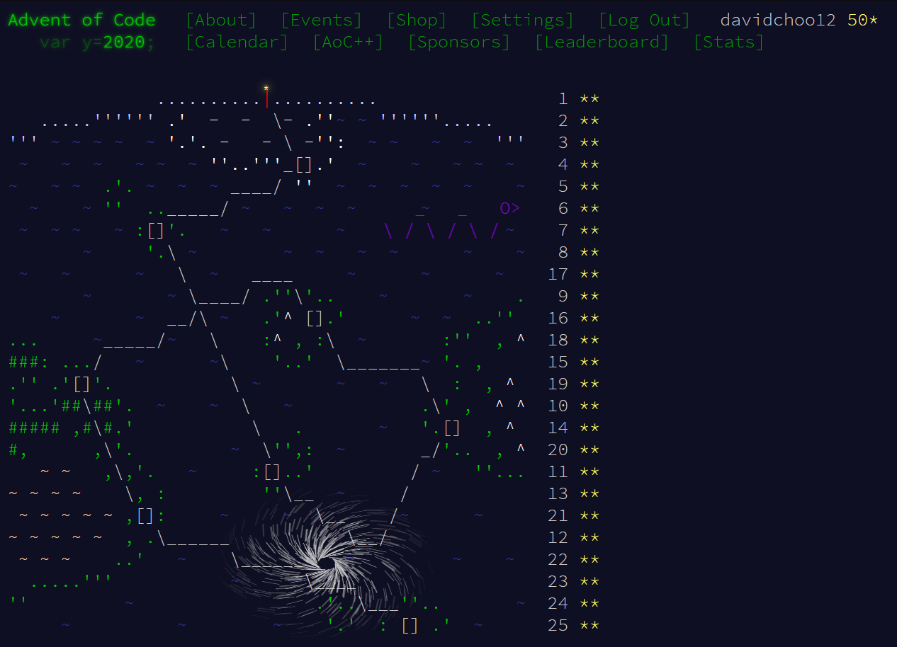

# Advent of Code 2020 solutions

My solution to Advent of Code 2020 in Rust. Just like [last year](https://github.com/davidchoo12/adventofcode2019), I took the opportunity to learn a new language which is Rust.

To run the code, do `cargo run --bin <file>` where file is any `.rs` file under `src/bin`. To run in release (optimized) mode, add `--release` to the command.

I think this year's challenges seem to be easier than last year's. There wasn't any day where I had to skip the challenge from being stucked. Last year's challenges had us progressively [develop an assembler](https://adventofcode.com/2019/day/2), [solve mazes](https://adventofcode.com/2019/day/15), [automate a game](https://adventofcode.com/2019/day/13). I also had a bit of help from the [NUSHacker's AoC telegram group](https://t.me/joinchat/D0bLNBjwEDocIe5BI_FqHw).

Here are some of the notable challenges this year.
| Problem | Notes |
|---------|-----------------------------------------------------------------------------------------------------------------------|
| 7 | part a needs mapping of child to parents, part b needs mapping of parent to children |
| 8 | start of assembler (here I thought it will be like last year where the assembler is developed in the subsequent days) |
| 10b | variant of [count ways to reach nth stair](https://www.geeksforgeeks.org/count-ways-reach-nth-stair/) |
| 11 | 2D cellular automata |
| 12 | when I realize the beauty of [pattern matching in Rust](src/bin/12a.rs#L764) |
| 13b | [see below](#13b) |
| 17 | 3D and 4D(!) variant of Conway's Game of Life |
| 19 | [see below](#19) |
| 20a | [see below](#20a) |
| 20b | [see below](#20b) |
| 21 | similar to 16b where we do process of elimination |
| 22b | takes >20 mins to run! Likely due to the `.clone()` calls |
| 23 | [see below](#23) |
| 24 | [see below](#24) |

### 13b

Chinese Remainder Theorem, initially solved by [sieving](https://en.wikipedia.org/wiki/Chinese_remainder_theorem#Search_by_sieving) which is simpler and less efficient. I learnt and implemented the proper way of solving using [Extended Euclidean Algo](https://en.wikipedia.org/wiki/Chinese_remainder_theorem#Using_the_existence_construction) in [13b2.rs](src/bin/13b2.rs).

### 19

I solved this the lazy way using regex. Since Rust's regex does not support recursion, I just construct the regex to a reasonable 10 levels of recursion as pointed out by someone in the telegram group. I am aware there is a [proper solution](https://www.youtube.com/watch?v=S3uPaqHcq3I) called the [CYK algorithm](https://en.wikipedia.org/wiki/CYK_algorithm).

### 20a

I tried encoding the edges in a symmetric way by counting the no of outermost `#`s to innermost `#`s. This way it ignores rotation and flipping but discards the ordering. For example an edge of `.#.###..` will encode as `0112`. However `0112` can also be encoded from `.####...`. This worked for the example case but failed for the actual input seemingly because the actual input is large enough that the edges also need the ordering to be identified.

### 20b

The most tedious problem! 3 parts to solve this problem - finding the corners (solved in part a), stitching all the tiles by finding each tile's correct orientation, finding the monsters by trying out each orientation of the whole map. I spent the most time on the stitching part. I guess the easier solution would be to brute force the stitching by looping every tile and every tile's orientation until all edges fit.

### 23

Linked list problem. I needed to use a form of iterator that allows modifying a node's `next` pointer. The closest thing I can find for Rust is the [Cursor](https://doc.rust-lang.org/std/collections/struct.LinkedList.html#method.cursor_front) but it is still in nightly and doesn't seem to support modifying `next` pointer. I saw someone in the telegram group mentioned using a map which I think was brilliant! A map can also support finding the destination cup in O(1) time instead of O(n) time for linked list. So I implemented it using a map of number to next number.

### 24

Hexagonal cellular automata. I encoded the neighbours using 2D vectors such that the magnitude of x in the east and west vectors are twice the magnitude of x in the diagonal vectors. There are other interesting ways of [coordinating hexagonal space](https://www.redblobgames.com/grids/hexagons/#coordinates).

## My Rust Experience

I had wanted to try Rust ever since it was awarded [the most loved language in the StackOverflow Survey](https://insights.stackoverflow.com/survey/2020#technology-most-loved-dreaded-and-wanted-languages-loved). For context, I am comfortable with Javascript and Python as my main languages. I also had worked with compiled languages before like Java and C++.

### What I Liked

Sorted by most liked first:

- Very helpful error messages. Error messages points to where exactly in the code that causes the issue, not the typical stacktrace with line numbers. Often error messages also comes with suggestions on what to change to fix the issue. This saves a lot of time when debugging the errors. More languages should do this!
- The [Rust Playground](https://play.rust-lang.org/) where I can test out my code quickly and easily.
- [Pattern matching](https://doc.rust-lang.org/rust-by-example/flow_control/match.html) is like a mix between `switch` and `if else` statements which helps in writing more elegant code in some cases, such as for day 12.
- Scopes return a value if you don't end the last line with a semicolon, which is why I can write `c = if cond {a} else {b}` as a ternary operator alternative.
- Rust has a `Range` type which is nice for `for` loops, similar to `range()` in Python. Rust also has `.enumerate()`, also similar to Python.
- `while let` and `if let` allows destructuring `Option` type and handling it at the same time.

### What I Disliked

I think many of the reasons I disliked is simply due to using it for the unintended use case. Rust is designed as a systems language where good performance is necessary and bugs sensitive. I am using it to solve algorithmic problems where I don't need the best performance and I don't need to protect every possible edge cases. I am also comparing it a lot with Python. Rust is also a relatively new language, so there is not as much StackOverflow questions to get help from.

Sorted by most annoying first:

- The [Ownership concept](https://doc.rust-lang.org/book/ch04-00-understanding-ownership.html) which is unique to Rust. It is similar to C++'s referencing and dereferencing operations but with scoping and mutability in mind. This concept probably caused at least 50% of my failed runs. The [Rust book](https://doc.rust-lang.org/book/ch04-01-what-is-ownership.html) explains it the best. The error messages became clearer to me after reading the entire Ownership chapter. I highly recommend reading the chapter if you are starting out on Rust.
- Many of Rust's functions returns the [`Option`](https://doc.rust-lang.org/std/option/enum.Option.html) type (akin to the Optional type in Java), which I guess is good for engineering systems as [null types is a billion dollar mistake](https://news.ycombinator.com/item?id=12427069), but it makes handling the `Option`s return values quite verbose, having to call `.unwrap()` to get the actual return value. If you just search for `unwrap` in the repo, it exists in most files. Similarly for the `Result` type, I have to call `.expect()` to get the actual value.
- The typical list's functional methods (like `.map`, `.filter`, `.reduce` in Javascript) are implemented under the [`Iterator`](https://doc.rust-lang.org/std/iter/trait.Iterator.html) type in Rust. Some of them (`.map` and `.filter` for example) are lazily evaluated, so I have to call `.collect()` to get the evaluated list.
- Printing any variable always requires string formatting like `println!("{}", var)` or `println!("{:?}", list)` for non primitive types like lists.
- Strings in Rust are complicated. There is the `&str` type and there is the `String` type. String operations methods are under `String` type. A `String` can only `+` with a `&str`. Characters are not indexed in strings! To access a specific character, you need to call `.chars().nth(n)` where n is the index. This is the first time I encounter a language which doesn't index characters in a string. The reason for not indexing characters is for [supporting UTF-8 encoding](https://doc.rust-lang.org/book/ch08-02-strings.html#indexing-into-strings) where a character can be represented in multiple bytes.
- Slicing in Rust [does not support negative indexing](https://github.com/rust-lang/rfcs/issues/2249) which is available in Python and [Javascript](https://developer.mozilla.org/en-US/docs/Web/JavaScript/Reference/Global_Objects/Array/slice). So whenever I needed it, I have to do `[0..thislist.len()-1]` for example.
- Indexing in Rust require using `usize` type, which is unsigned integer. So whenever I have to do arithmetic with a normal `i32` signed integer, I have to do conversions here and there.
- No standard parsing function for parsing between primitive types. String to int is `.parse::<i32>().expect()`, char to i32 is `.to_digit(10).unwrap()`, any number to any number is `as <target number type>` (eg `1 as u64`), etc.
- No ternary operator. Just have to do a oneliner `if cond {a} else {b}`.
- No array destructuring like `[a,b] = [0,1]` in Python and Javascript, but you can destructure tuples which is often handy.
- `match` requires a `_` rest case, akin to `default` in Java's `switch` statements, except `default` is optional in Java.
- Integer type is spelled `i32`. I kept typoing to `int` at first.
- Rust is a compiled language, understandably for good performance. I personally disliked compiled languages due to having to wait for compilation on every run.
- Rust does not have built in regex functionality. It is an [external package](https://github.com/rust-lang/regex).

### Summary

Overall, I think Rust sits between Java and C++ in terms of difficulty. I can sense that it can produce very safe software if used properly. It is still very new relative to all the other languages that I mentioned. So there are less community support in the form of StackOverflow questions. I think the best resource for learning Rust is probably by reading the official [Rust book](https://doc.rust-lang.org/book/) which I did not do until I struggled with errors dealing with the Ownership concept. I only read the Ownership chapter and it is enough for me to solve the challenges. I will probably not touch Rust again unless maybe if I ever explore on web assembly.

Quoting from Florian Gilcher (Rust core team member) ([source](https://stackoverflow.blog/2020/06/05/why-the-developers-who-use-rust-love-it-so-much/)):

> I don’t think Rust has a higher barrier to learning than any other language in the long run. It’s a pretty consistent language and once you have the basics down, they can carry you very far. There’s an immediate bump on that road, though: Rust is the worst language out there to run before you walk. The reason for that is that its core concepts, especially Ownership, don’t have something to compare to in other programming languages. And that concept is very nuanced. This means that Rust is hard to pick up in a day or two. Most people report that they need roughly one to two weeks to become productive with it. People that are productive in Rust appreciate a certain rigor and strive for correctness, but that takes some time to build.
